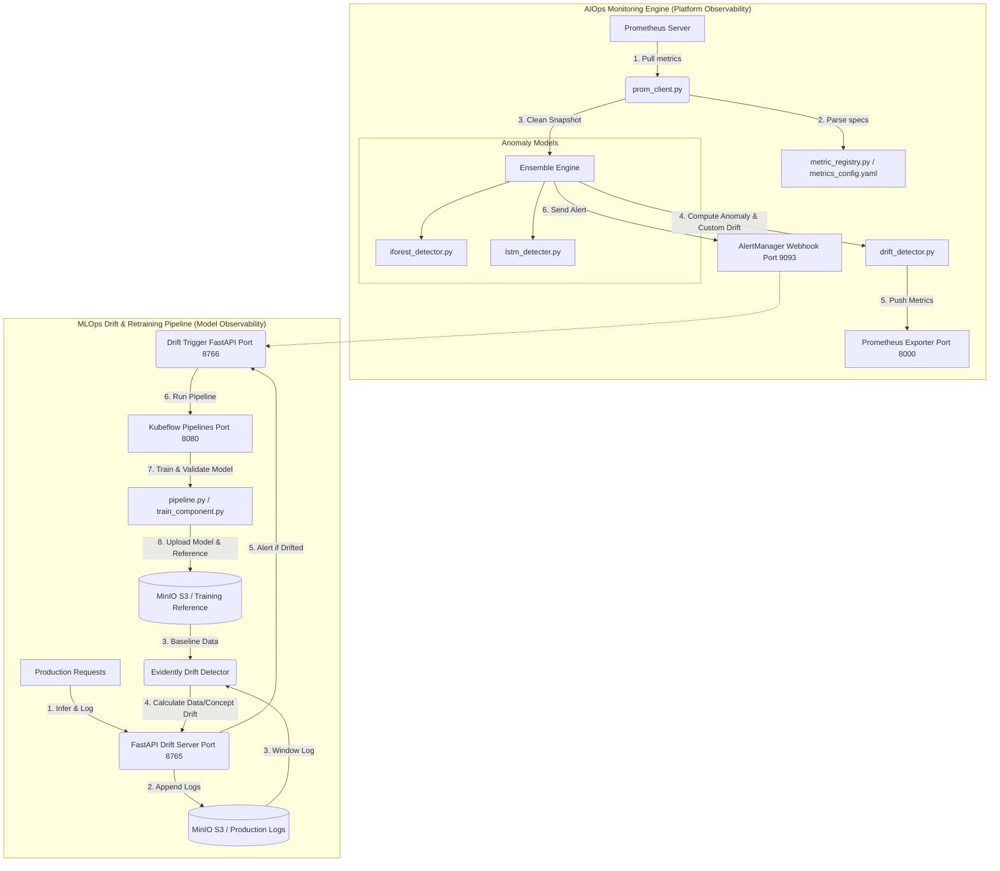

# Dual-Engine MLOps & AIOps Platform

This repository implements a production-grade, closed-loop platform that contains two distinct systems:
1. **AIOps Infrastructure Anomaly Detection & Monitoring Engine**: An ensemble-based framework that pulls metrics from Prometheus, evaluates them using Isolation Forest and LSTM Autoencoders to detect anomalies, checks for metrics distribution shifts, and handles alerting.
2. **MLOps Model Observability & Retraining Pipeline**: A churn prediction system featuring automated data drift and concept drift detection using Evidently AI, a FastAPI inference and logging server, and closed-loop retraining triggered on Kubeflow Pipelines (KFP) using data saved on MinIO.

---

## 🏗️ System Architecture

The interaction between the Prometheus AIOps stack, the FastAPI Drift Stack, MinIO S3, and Kubeflow Pipelines is illustrated below:



---

## 📁 Repository Map

### [1. AIOps Monitoring Engine (Root)](./)
This component monitors infrastructure performance declaratively across multiple layers.
*   **[Ensemble_engine.py](Ensemble_engine.py)**: The main orchestrator file. Operates in `train`, `run` (live polling loop), and `compare` modes. Exposes Prometheus gauges and fires alerts.
*   **[metrics_config.yaml](metrics_config.yaml)**: Declarative definition of features/metrics, units, normal ranges, and hierarchy.
*   **[metric_registry.py](metric_registry.py)**: Helper loading `metrics_config.yaml` declarations into typed Python configurations.
*   **[prom_client.py](prom_client.py)**: Prometheus HTTP client fetching instant snapshots and training baselines.
*   **[iforest_detector.py](iforest_detector.py)**: Points anomaly detector using Isolation Forest. Captures multivariate spikes.
*   **[lstm_detecter.py](lstm_detecter.py)**: Sequence anomaly detector using LSTM Autoencoders (looks at sliding time-windows).
*   **[drift_detector.py](drift_detector.py)**: Lightweight statistical drift engine calculating PSI (Population Stability Index) and KS-test (Kolmogorov-Smirnov) on monitored metrics.
*   **[check_metrics.py](check_metrics.py)**: Utility to quickly inspect metrics scraped from Prometheus.

### [2. Churn Model MLOps Drift Stack (drift/)](drift/)
This component tracks the performance of the churn prediction model and automates retraining.
*   **[drift/drifft_detector.py](drift/drifft_detector.py)**: Core model drift logic utilizing **Evidently AI** to compute Data Drift (input features covariate shifts) and Concept Drift (prediction distribution proxy shifts).
*   **[drift/drit_server.py](drift/drit_server.py)**: The FastAPI server that handles inference log ingestion, pulls reference data from MinIO, executes Evidently drift checks, exposes metrics on port `8765`, and calls the retrain trigger.
*   **[drift/drift_trigger.py](drift/drift_trigger.py)**: FastAPI webhook receiver on port `8766` that intercepts drift alerts (from the drift exporter or AlertManager) and automatically kicks off a new Kubeflow Pipeline run.
*   **[drift/simulate_drift.py](drift/simulate_drift.py)**: Data injection client simulating normal user queries, covariate/data drift, or concept drift to test detection and retraining.
*   **[drift/drift_config.yaml](drift/drift_config.yaml)**: Configures Evidently parameters, statistical thresholds, MinIO connections, and trigger cooldowns.
*   **[drift/drift_k8.yaml](drift/drift_k8.yaml)**: Kubernetes manifests for deploying the drift stack components (server, trigger, services).

### [3. Orchestration & Infrastructure](.)
*   **[pipeline.py](pipeline.py)**: The Kubeflow Pipeline (KFP v2) definition specifying the training workflow (`GenerateData` ➔ `Validate` ➔ `Train` ➔ `Evaluate` ➔ `Promote` ➔ `Save Reference Data`).
*   **[train_component.py](train_component.py)**: KFP component wrapper executing model training.
*   **[seed_minio.py](seed_minio.py)**: Scripts to bootstrap your MinIO instance with initial datasets.
*   **[k8s_crew.py](k8s_crew.py)**: CrewAI Infrastructure Analyst script designed to parse Kubernetes pod information via OLLAMA.
*   **[monitoring/](monitoring/)**: Holds AlertManager configuration files (`alertManager.yml`) and Prometheus ServiceMonitors (`argo_serviceMonitor.yml`).

---

## 🚀 Quickstart Guide

### 📦 1. Pre-requisites & Local Services
Ensure your local services are running and port-forwarded from Kubernetes:
```bash
# Forward Prometheus
kubectl port-forward -n monitoring svc/monitoring-kube-prometheus-prometheus 9090:9090

# Forward MinIO
kubectl port-forward -n kubeflow svc/minio-service 9000:9000

# Forward Kubeflow Pipelines dashboard
kubectl port-forward -n kubeflow svc/ml-pipeline-ui 8080:8080
```

Install requirements locally:
```bash
pip install -r requirements.txt
```

---

### 📈 2. AIOps Anomaly Engine Usage

The AIOps system uses a command-line interface via `Ensemble_engine.py`.

#### A. Train Anomaly Models
Pulls the baseline data from Prometheus, scales features, fits both Isolation Forest and LSTM, and saves models to `models/`:
```bash
python Ensemble_engine.py --mode train
```

#### B. Run Live Comparison Demo
Simulates normal, point anomalies, and node pressure anomalies side-by-side, comparing the response of Isolation Forest vs LSTM:
```bash
python Ensemble_engine.py --mode compare
```

#### C. Run Live Production Daemon
Runs in a daemon loop, querying Prometheus every 30 seconds, outputting status, updating Prometheus gauges, and firing alerts:
```bash
python Ensemble_engine.py --mode run
```

---

### 📉 3. Model Drift Stack Usage

The Model Drift Stack operates as microservices monitoring incoming prediction statistics.

#### A. Seed MinIO & Register Kubeflow Pipeline
Before checking drift, upload the baseline dataset to MinIO and register your pipeline on Kubeflow:
```bash
# Seed the MinIO bucket
python seed_minio.py

# Submit and compile pipeline definition to Kubeflow
python pipeline.py
```

#### B. Launch the Webhook Trigger Server
This server handles incoming HTTP posts from `drift_server.py` or Prometheus AlertManager and spins up a retraining run in Kubeflow.
```bash
cd drift
uvicorn drift_trigger:app --port 8766
```

#### C. Launch the Drift Observability Exporter
Start the main log ingest and drift analyzer server. It executes Evidently reports every 5 minutes in a background thread:
```bash
cd drift
python drit_server.py
```

#### D. Simulate Drift Traffic
Test the automated retraining behavior by simulating incoming production logs with different drift signatures:
```bash
# Option 1: Normal production distribution (No alerts)
python simulate_drift.py --mode clean --requests 150

# Option 2: Data drift (Changes monthly_charges and age)
python simulate_drift.py --mode data_drift --requests 150

# Option 3: Concept drift (Model predictions shift outward)
python simulate_drift.py --mode concept_drift --requests 150
```

---

## 🛠️ Configuration Systems

### Declarative Metrics Config (`metrics_config.yaml`)
To monitor a new Prometheus metric, you simply add it to the yaml file. No python modifications required:
```yaml
- name: aiops:node_cpu_pct
  unit: percent
  layer: node
  normal_min: 5.0
  normal_max: 60.0
  normal_std_pct: 15
  higher_is_bad: true
```

### Declarative Drift Config (`drift_config.yaml`)
Evidently AI's parameters, statistical tests, window sizes, and MinIO storage structures are declared centrally:
```yaml
data_drift:
  p_value_threshold: 0.05
  dataset_drift_threshold: 0.5
  feature_drift_threshold: 0.3
concept_drift:
  prediction_shift_threshold: 0.10
  min_prediction_std: 0.05
```

---

## 🏆 Key Takeaways & Architecture Notes

*   **Complementary Anomaly Detection**:
    *   *Isolation Forest* requires no training warmup and catches sudden, severe **point anomalies**.
    *   *LSTM Autoencoder* acts on sequences of windows and is suited for detecting slowly creeping **state anomalies** and drifts.
*   **Pull vs Push Architecture**:
    *   `drift_server.py` and `Ensemble_engine.py` behave strictly as Prometheus exporters (pull model). They host `/metrics` endpoints for Prometheus scraping rather than pushing metrics, complying with standard DevOps practices.
*   **Drift Proxying**: Because ground-truth churn labels are highly delayed in production, we implement proxy concept drift detection by monitoring the model's prediction distribution shifts instead of true model error.
