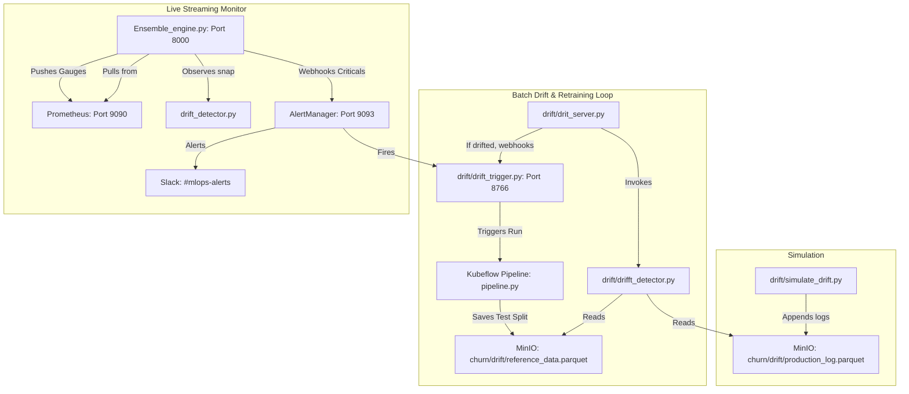

# Churn Prediction Drift Detection & Auto-Retraining Architecture

This document summarizes the analysis of the project's drift detection system, including the data flows, file dependencies, and execution steps for simulating and detecting drift.

---

## 1. High-Level Flow and Architecture

The system utilizes two distinct types of drift detection working side by side:

### A. Online/Streaming Drift Monitoring (Root-level `drift_detector.py`)
- **Orchestrated by**: [Ensemble_engine.py](file:///wsl.localhost/Ubuntu/home/crysis/project_1/Ensemble_engine.py#L310-L386)
- **Engine**: A custom implementation in [drift_detector.py](file:///wsl.localhost/Ubuntu/home/crysis/project_1/drift_detector.py) using `scipy.stats.ks_2samp` for Kolmogorov-Smirnov (KS) tests and a custom Population Stability Index (PSI) formula.
- **Data Source**: Live input snapshots collected in a rolling buffer (size 30) from Prometheus client readings in [Ensemble_engine.py](file:///wsl.localhost/Ubuntu/home/crysis/project_1/Ensemble_engine.py#L348-L358).
- **Output**: Exposes streaming metrics (`ml_drift_psi`, `ml_drift_active`, and per-feature `ml_drift_feature_psi`) directly to the Prometheus metrics server on port **8000**. It also prints reports to the terminal console every 10 polls.

### B. Batch Observability & Retraining Loop (`drift/` directory)
- **Orchestrated by**: [drift/drit_server.py](file:///wsl.localhost/Ubuntu/home/crysis/project_1/drift/drit_server.py)
- **Engine**: [drift/drifft_detector.py](file:///wsl.localhost/Ubuntu/home/crysis/project_1/drift/drifft_detector.py) (uses Evidently AI for dataset-level data drift and proxy concept drift monitoring).
- **Data Source**: Loads historical datasets from MinIO:
  - **Reference**: `churn/drift/reference_data.parquet` (uploaded by the Kubeflow training pipeline).
  - **Production**: `churn/drift/production_log.parquet` (requests appended by traffic or simulation).
- **Output**: Exposes metrics on port **8765** for Prometheus to scrape. If retraining is recommended (overall drift score > threshold), it fires a webhook POST request to the trigger service.

---

## 2. Dependency & Data Flow Mapping

The dependencies among components are mapped as follows:



### Key Dependencies of God Nodes (from `graphify`):
- `DriftDetector` (in `drift_detector.py`): Serves as a bridge node connecting the anomaly detection ensemble (`EnsembleDetector`) to the metric monitoring system.
- `EnsembleDetector` (in `Ensemble_engine.py`): Combines predictions from the `IsolationForestDetector` (point anomalies) and `LSTMDetector` (sequential anomalies) and acts as the gatekeeper for alerting.

---

## 3. How to Run and Simulate Drift

To verify and test this setup, follow these steps sequentially:

### Step 1: Start Core Infrastructures
Make sure Prometheus and Alertmanager port-forwards are active:
```bash
# Port-forward Prometheus
kubectl port-forward -n monitoring svc/monitoring-kube-prometheus-prometheus 9090:9090 &

# Port-forward Alertmanager
kubectl port-forward -n monitoring svc/monitoring-kube-prometheus-alertmanager 9093:9093 &

# Port-forward MinIO
kubectl port-forward -n kubeflow svc/minio-service 9000:9000 &
```

### Step 2: Seed Baseline & Train Models
```bash
# Register and run the training pipeline (to create the reference parquet in MinIO)
python pipeline/pipeline.py

# Start live ensemble monitoring (which loads drift detector)
python Ensemble_engine.py --mode run
```

### Step 3: Run the Drift Server & Trigger
Start the background drift checking exporter and the retraining trigger listener:
```bash
# In terminal window 1: Start retraining trigger server
python drift/drift_trigger.py

# In terminal window 2: Start Batch drift server
python drift/drit_server.py
```

### Step 4: Simulate Production Traffic and Drift
Use the simulation script to append clean or drifted traffic log payloads to MinIO:
```bash
# To test stable conditions (clean distribution)
python drift/simulate_drift.py --scenario clean --n 200

# To inject feature/data drift (monthly_charges +40%, age younger)
python drift/simulate_drift.py --scenario drift --n 200

# To inject concept drift (predictions shifted high, inputs stable)
python drift/simulate_drift.py --scenario concept --n 200
```
Upon uploading drifted data, `drift/drit_server.py` will catch the drift at the next check, update its Prometheus metrics on port `8765`, and POST to `drift/drift_trigger.py` to trigger an auto-healing retraining pipeline run in Kubeflow.
